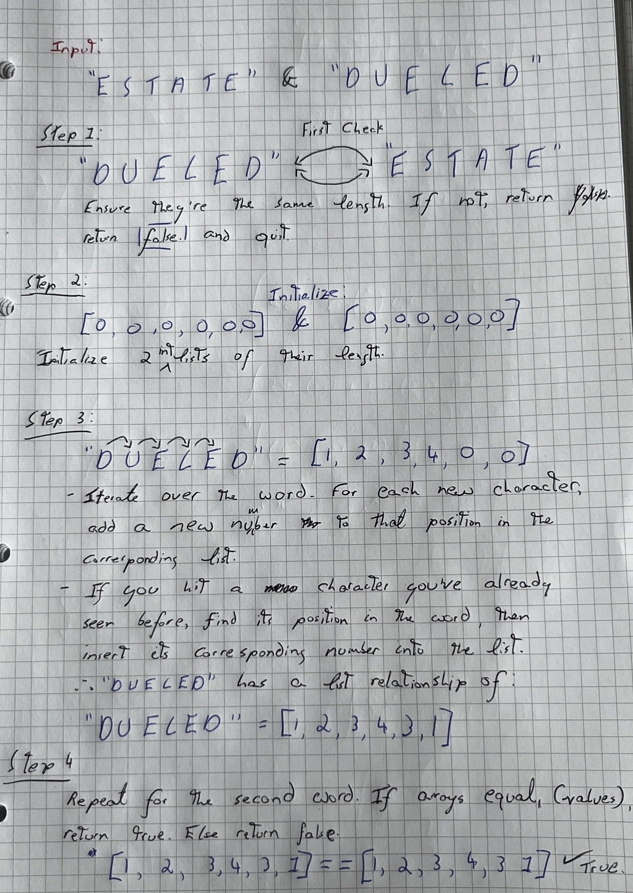

# First design #

- Leo Camacho
- S2222816
- 11
- Ray Jiang
- 2023-02-15

# Diagram #



# Algorithm pseudo-code #

```
word1 = INPUT[0]
word2 = INPUT[1]

if length(word1) not equals length(word2) // Automatically not isomorphic
  return FALSE 

else:
  INITIALISE word1Array // Initialises to [0,0...,0]
  INITIALISE word2Array
  
  FOR both words 
    i = 0
    FOR every letter in word1
      IF (letter has NOT been seen before)
        Add i to the array at the letters position
      ELSE 
         prevI = Get the previous i used at that letter's position
         Add prevI to the array
      i = i+1
  IF (Arrays have same Value)
    return true
  ELSE
    return false

```

<STYLE>
* {
  font-size:   1rem;
  /*font-size:   1.2rem;*/
  /*font-size:   0.9rem;*/
  background-color: #2A252A;
  color:            #D5DAD5;
  /*background-color: DarkSlateGray;*/
  /*color:            AntiqueWhite;*/
  /*background-color: black;*/
  /*color: white;*/
  /*background-color: white;*/
  /*color: black;*/
}
body {
  width: 80%;
  font-family: "OpenDyslexic", serif;
  /*font-family: sans-serif;*/
  line-height: 180%;
  /*line-height: 200%;*/
}
pre,
code,
pre code {
  font-family: "OpenDyslexicMono", monospace;
  line-height: 150%;
}
ol,
ol ol,
ol ol ol {
  list-style-type: decimal;
}
em {
  font-style: normal;
  border-bottom-style: solid;
  border-bottom-width: 1px;
  padding-bottom:      2px;
  /*text-decoration: underline;*/
  text-decoration-skip-ink: auto;
}
h2 {
  border-top:  1px solid #D5DAD5;
  margin-top:  80px;
  padding-top: 20px;
  }
</STYLE>
